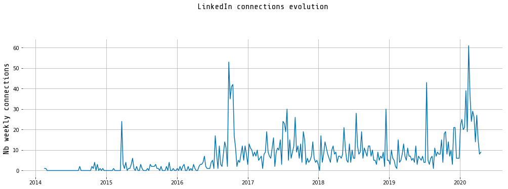
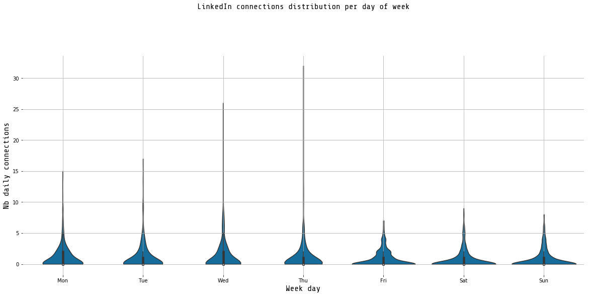
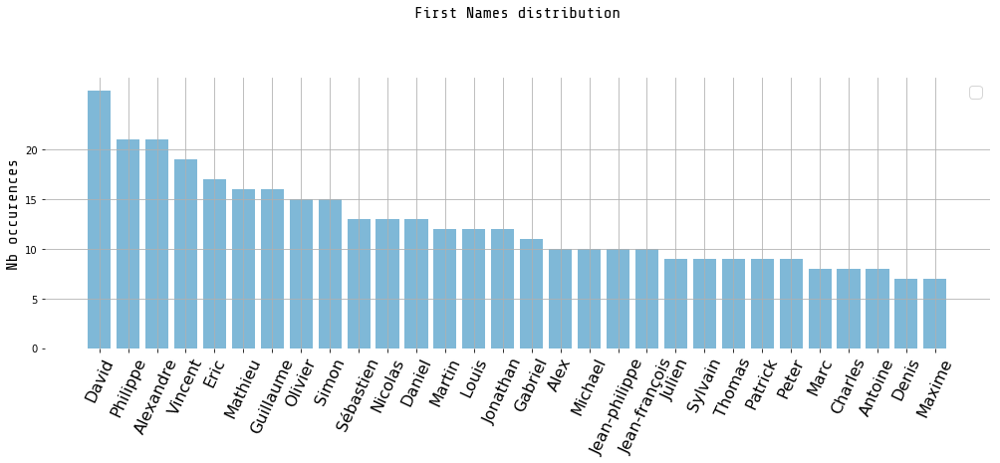

# [LinkedIn Connections Analysis](https://github.com/guillaume-chevalier/LinkedIn-Connections-Analysis)

For my profile: Guillaume Chevalier
- https://www.linkedin.com/in/chevalierg/
- https://github.com/guillaume-chevalier

## Step 1: Download data.

1. Download your connections info on LinkedIn. Navigate on linkedin.com: `me > settings and privacy > How LinkedIn uses your data > Getting a copy of your data > tick "Connections" under "Want something in particular" > Download archive`. You'll get it by email within 10 minutes or so. 
2. Then edit the file to keep only 2 columns in the data and save it:
  - first_name
  - connection_date

The code used here is derived from this original article here:
https://medium.com/@yrieix.leprince_14799/what-does-linkedin-know-about-you-81cd65c69cb

Note: I wasn't able to get gender data as in the original article, so I have simplified the code as [hereby](https://github.com/guillaume-chevalier/LinkedIn-Connections-Analysis). 

## Step 2: run the code below.


```python
import pandas as pd
import matplotlib.pyplot as plt

from utils import plot_weekly_connection
from utils import plot_cumsum
from utils import plot_violins
from utils import plot_bar_name
```


```python
path = './data/'
file = 'connections_preprocessed.csv'
```

### Load File + minor preprocessing


```python
df = pd.read_csv(f'{path}{file}')
df.connection_date = pd.to_datetime(df.connection_date)
df.set_index('connection_date', inplace=True, drop=True)
df.sort_index(inplace=True)
df = df.assign(added=1)
```

## Data Exploration


```python
df.head()
```


<div>
<style scoped>
    .dataframe tbody tr th:only-of-type {
        vertical-align: middle;
    }

    .dataframe tbody tr th {
        vertical-align: top;
    }

    .dataframe thead th {
        text-align: right;
    }
</style>
<table border="1" class="dataframe">
  <thead>
    <tr style="text-align: right;">
      <th></th>
      <th>first_name</th>
      <th>added</th>
    </tr>
    <tr>
      <th>connection_date</th>
      <th></th>
      <th></th>
    </tr>
  </thead>
  <tbody>
    <tr>
      <th>2014-02-11</th>
      <td>Francois</td>
      <td>1</td>
    </tr>
    <tr>
      <th>2014-02-17</th>
      <td>Gaetan</td>
      <td>1</td>
    </tr>
    <tr>
      <th>2014-08-12</th>
      <td>Frédérick</td>
      <td>1</td>
    </tr>
    <tr>
      <th>2014-08-13</th>
      <td>Marc-André</td>
      <td>1</td>
    </tr>
    <tr>
      <th>2014-10-13</th>
      <td>Jean-François</td>
      <td>1</td>
    </tr>
  </tbody>
</table>
</div>


```python
plot_weekly_connection(df)
```





```python
plot_cumsum(df)
```


```python
plot_violins(df)
```





```python
plot_bar_name(df)
```

    No handles with labels found to put in legend.





Oops. It looks like my network is dominated by males, as 100% of the top most-occuring names above are masculine. Well, unfortunately that is a normal side effect from being way deep into the software industry and having worked on technical/coding stuff since forever. 

## Step 3: enjoy, like, and share! 

You can find the related article on my blog here, and connect with me on LinkedIn and GitHub as well: 
- https://www.linkedin.com/in/chevalierg/
- https://github.com/guillaume-chevalier

Why not do a LinkedIn post about this and tag me whilst linking to the code for others to enjoy as well?

Thank you!


```python
# Let's convert this notebook to a README automatically for the GitHub project's title page:
!jupyter nbconvert --to markdown LinkedIn-Connection-Plots.ipynb
!mv LinkedIn-Connection-Plots.md README.md
```

    [NbConvertApp] Converting notebook LinkedIn-Connection-Plots.ipynb to markdown
    [NbConvertApp] Support files will be in LinkedIn-Connection-Plots_files/
    [NbConvertApp] Making directory LinkedIn-Connection-Plots_files
    [NbConvertApp] Making directory LinkedIn-Connection-Plots_files
    [NbConvertApp] Making directory LinkedIn-Connection-Plots_files
    [NbConvertApp] Making directory LinkedIn-Connection-Plots_files
    [NbConvertApp] Writing 4414 bytes to LinkedIn-Connection-Plots.md

