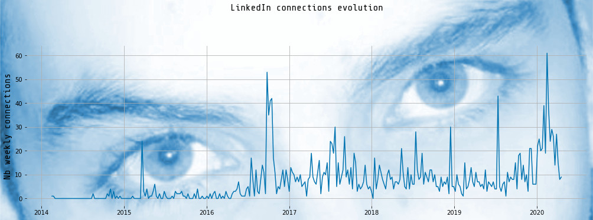
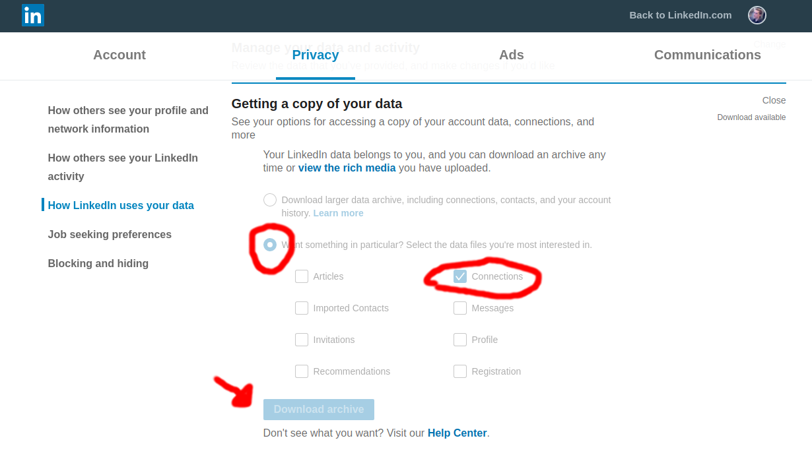
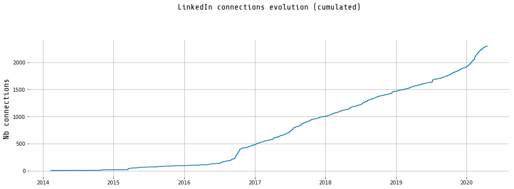
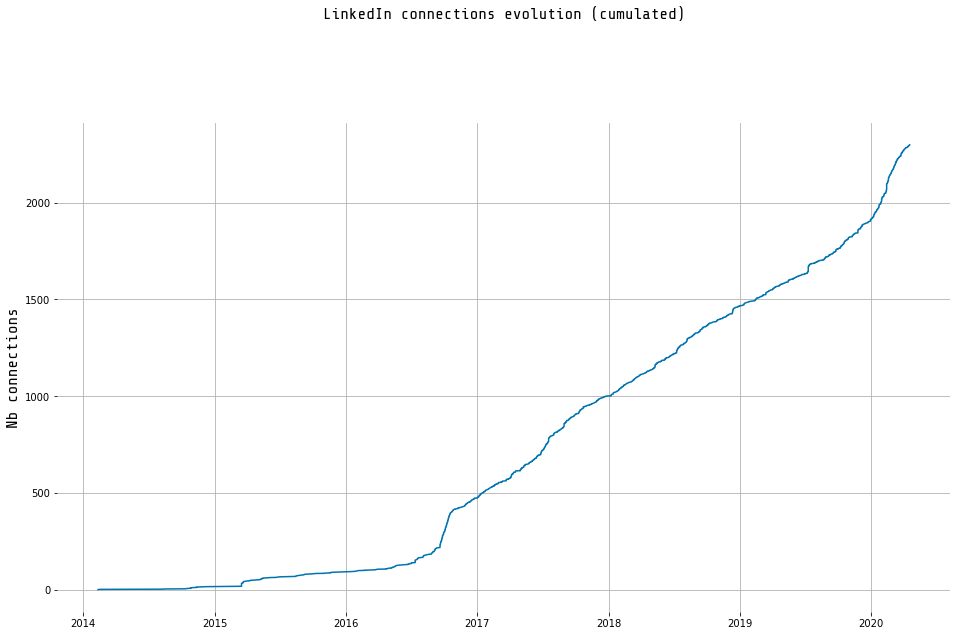
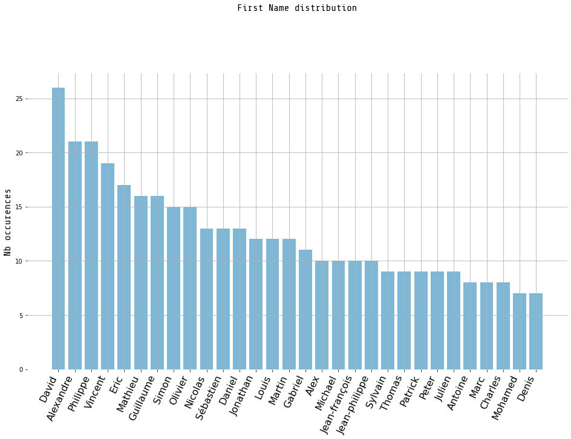
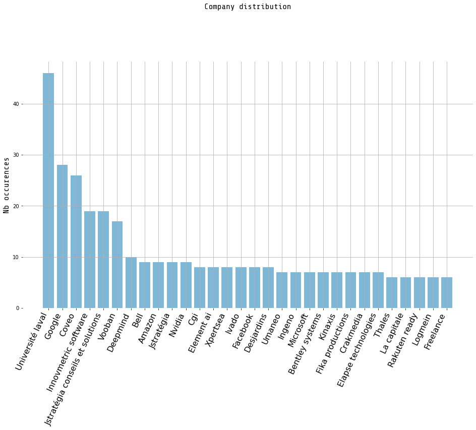
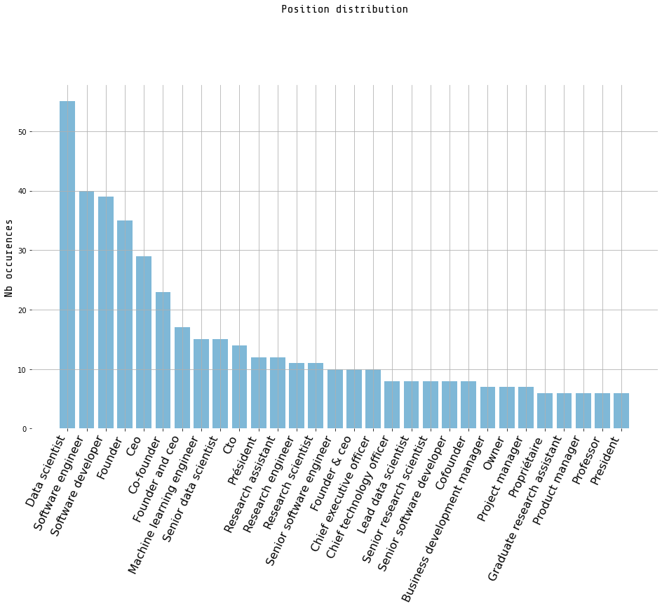
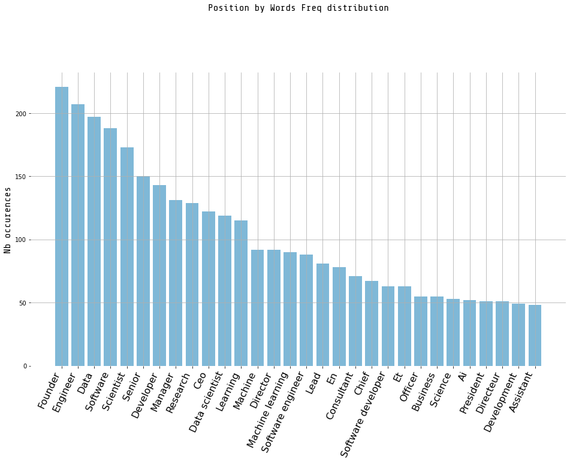

# [LinkedIn Connections Analysis](https://github.com/guillaume-chevalier/LinkedIn-Connections-Analysis)

>>> Assessing personal growth on LinkedIn with charts.



You can use the code in here to try it with your profile.

I've done it with mine now: [Guillaume Chevalier](https://www.linkedin.com/in/chevalierg/). That is me in the picture.

## Intro

Plotting the number of new connections over week on my LinkedIn account, then the cumulative connections, and then see on which days I was most active. I have 2305 connections on LinkedIn as of today. Finally, I chart the most common names in my network and positions, then realize my LinkedIn network mainly consists of high-status males.


## Step 1: Download your data.

Download your connections info on LinkedIn. Navigate on linkedin.com:

> `me > settings and privacy > How LinkedIn uses your data > Getting a copy of your data > tick "Connections" under "Want something in particular" > Download archive`

You'll get it by email within 10 minutes or so.




## Step 2: run the code below.

I've made the code I used here available on [GitHub](https://github.com/guillaume-chevalier/LinkedIn-Connections-Analysis), and it is built upon the code from this other [related article](https://medium.com/@yrieix.leprince_14799/what-does-linkedin-know-about-you-81cd65c69cb).


```python
import pandas as pd
import matplotlib.pyplot as plt

from plot import plot_weekly_connection, plot_cumsum, plot_violins, plot_bar_column, plot_nlp_cv
```


```python
path = './data/'
file = 'Connections.csv'
```

### Load Connections Data


```python
df = pd.read_csv(f'{path}{file}')
df['Connected On'] = pd.to_datetime(df['Connected On'])
df.set_index('Connected On', inplace=True, drop=True)
df.sort_index(inplace=True)
df = df.assign(added=1)
```

### Data Exploration

With my comments between charts. Let's begin by showing my first ever contact on LinkedIn to see what's in the CSV. Thank you Francois for being my first contact. You helped me start this journey.


```python
df.head(1)
```


<div>
<style scoped>
    .dataframe tbody tr th:only-of-type {
        vertical-align: middle;
    }

    .dataframe tbody tr th {
        vertical-align: top;
    }

    .dataframe thead th {
        text-align: right;
    }
</style>
<table border="1" class="dataframe">
  <thead>
    <tr style="text-align: right;">
      <th></th>
      <th>First Name</th>
      <th>Last Name</th>
      <th>Email Address</th>
      <th>Company</th>
      <th>Position</th>
      <th>added</th>
    </tr>
    <tr>
      <th>Connected On</th>
      <th></th>
      <th></th>
      <th></th>
      <th></th>
      <th></th>
      <th></th>
    </tr>
  </thead>
  <tbody>
    <tr>
      <th>2014-02-11</th>
      <td>Francois</td>
      <td>Gagnon</td>
      <td>NaN</td>
      <td>Government of Canada</td>
      <td>Cybersecurity Analyst</td>
      <td>1</td>
    </tr>
  </tbody>
</table>
</div>


#### Let's now plot my gained weekly connections.


```python
plot_weekly_connection(df)
```





Regarding the peaks: it seems that the moments where I've got the most new connections were moments where I posted content that got viral or that got a lot of attention. I believe more people added me than the other way around despite I'm very outgoing in general. At other times, I took some time to add people in positions I liked, such as between jobs or when going to networking events (or even organizing them).


```python
plot_cumsum(df)
```





Regarding the sustained growth: it seems that what got me the most growth was definitely writing articles and online content, where I linked back to my social media profiles at the end of those pieces of content.

It turns out that I was also often presenting this content for doing talks. So my sustained growth on the social media platform was mostly due to publishing content at other places and linking back to LinkedIn.

==> That is quite linked in. Badumm tsss.

#### What brought me more connections?

For instance, my [GitHub tutorials and projects on machine learning](https://github.com/guillaume-chevalier) caused a steady increase from the summer of 2016 when it boomed. I then continued to build GitHub projects and posting them. And recently in 2020, I've organized many [group trainings](https://www.neuraxio.com/en/time-series-solution) whilst creating some more related content and products along the way.

Before that, we can see in 2015 that I was pretty normal. It felt pretty normal, too, until I started doing some more talks and being more involved, which was something I've deliberately started doing once I realized that the best opportunities wouldn't come to me magically by studying just what everybody else did study at school. Unsatisfied with my current roles, I started being more outgoing and doing talks to how I did some of my projects that were oriented towards innovation.

I'll always remember in 2014 when my supervisor at Coveo, Guillaume Simard, told me that "only quite good people get to code new algorithms". This shaked me as coding algorithms was my favourite hobby and what I was best at. So I needed to prove I was good then, because I was young and motivated and excellent but I had nothing to show. I had won already a few coding competitions such as being [a regionnal winner at the CCC of Waterloo](https://cemc.math.uwaterloo.ca/contests/computing/2015/stage%201/2015CCCRegionalResults.pdf). Despite all of that, I was noob and I needed to evolve. That was the turning point in early 2015 in the chart where I've discovered the existence of machine learning at the same time, including the brand new field of deep learning. It was the way to go for coding new algorithms and innovating. I had to continue to be creative as creativity is a must - I was composing dubstep and drawing motion graphics / 3D things before going fully into the programming route. Here is a related recommendation of mine after this analysis:

#### Some advice for young aspiring professionals seeking to land more job opportunities aligned with what they truly want to do:

Put some code or work online, however ugly it is in the first place (you may learn [Clean Code](https://github.com/guillaume-chevalier/Awesome-Deep-Learning-Resources/blob/master/README.md#books) after, no worries), and to explain it in talks at conferences and in the README file of your project.

Plus, if you like to work on new things that aren't commonly done, explaining it will also be a plus for the community.

For instance, when you attend classes where you can choose on your own what will be the topic of your project, take this opportunity to create something new and to post it online. Everything you do must be useful to some goal. While you're at doing it, why not put another 20% efforts in actually putting this out there and making this useful for your future? This is what I've started doing in 2014-2015 as well.

As much as employers or clients like to see you occupied many positions, employers want to see what you're capable of, and being able to point to concrete work is reassuring for them, especially in R&D and innovation roles. Show them what you're capable of and that you're not a nobody.

#### New connections by days of week


```python
plot_violins(df)
```


It seems that in this violin plot, I've added most people during the week. I especially went on frenzies by Thursday, after what I probably just got pissed.

#### Let's now plot the counts of first names


```python
plot_bar_column(df, "First Name")
```





Hay hi! David, Alexandre, Philippe, Vincent, Éric Mathieu, and all the other Guillaumes. Your names are quite repetitives, sirs.

*...but oops.*

It looks like my network is dominated by males, as 100% of the top most-occuring names above are masculine. Well, unfortunately, that is a normal side effect from being way deep into the software industry and having worked on technical/coding stuff since like just forever.

It also seems that my network, despite I have connections all around the globe, are mostly local when it comes to top name frequencies. That is logical as each other international connection has a name that has a higher probability to be radically different than what I'm used to. For instance, I estimate that more than 3/4 of my connections are international, but despite this, my network contains repetitive first names because of the 1/4th of local contacts, which makes sense.

It's fun to note that during my bachelor I published scientific articles with other universities the most. I don't have a master nor Ph.D despite I could have done that accelerated and have already produced more research than the average Ph.D. so going that route felt like a loss of time. I'd have truly wanted to start a Ph.D. at the moment I started my bachelor and have felt like if I was chained during my whole bachelor, doing research elsewhere.

#### Let's now plot where my contacts works the most


```python
plot_bar_column(df, "Company")
```





Most of my contacts are in fields of machine learning & data science, or otherwise do software development. Ironically, my city, Quebec City, is known for its numerous big insurance companies and public sector, and it seems that I'm completely out of the map on that point, rather focusing on something else in the private tech sector.

#### What do my connections do?


```python
plot_bar_column(df, "Position")
```





Okay. I'm actually impressed here in contrast with the previous charts. Looking at names I was finding mostly local people that may be working in various sectors. But from title/position now it's clear that I'm connected with a quality network of data scientists, engineers, researchers, profs, and C-suite executives.

Let's now plot the same chart, but by using word (or short expressions) counts rather than exact titles using scikit-learn's word count vectorizer:


```python
plot_nlp_cv(df)
```





## Step 3: what about you? Try it and share it!

Give it a try with your data. You may post your results it on LinkedIn as well.

==> [Get the code on GitHub](LinkedIn-Connections-Growth-Analysis).

For the time being... you could also [connect with me on LinkedIn](https://www.linkedin.com/in/chevalierg/) and tag me in your post with your stats ;) I hope this can help you get insight in your LinkedIn profile's growth.

Thank you!

## Conclusion

I've been on LinkedIn for 6 years and 2 months or so. I've recently seen gaining approx 100 connections per month (roughly 3 connections per day), but it wasn't always like that. Having 2305 connections right now, that means I was growing at a rate of approx 31 connections per month in average over the 6 years and 2 months otherwise, or 1 connection per day.

With the present statistics, I also now realize how dense is my LinkedIn network in terms of data scientists and related practitioners & executives. Accepting and sending connection requests in the day-to-day didn't feel that much focused on one thing, but I just now realize how targeted and concentrated my network is in this direction.

I hope for the future of my growth to be even more massive.

___


You can also find this article on [my blog](https://guillaume-chevalier.com/assess-linkedin-connections-growth-analysis/). 


```python
# Let's convert this notebook to a README automatically for the GitHub project's title page:
!jupyter nbconvert --to markdown LinkedIn-Connection-Plots.ipynb
!mv LinkedIn-Connection-Plots.md README.md
```

    [NbConvertApp] Converting notebook LinkedIn-Connection-Plots.ipynb to markdown
    [NbConvertApp] Support files will be in LinkedIn-Connection-Plots_files/
    [NbConvertApp] Making directory LinkedIn-Connection-Plots_files
    [NbConvertApp] Making directory LinkedIn-Connection-Plots_files
    [NbConvertApp] Making directory LinkedIn-Connection-Plots_files
    [NbConvertApp] Making directory LinkedIn-Connection-Plots_files
    [NbConvertApp] Making directory LinkedIn-Connection-Plots_files
    [NbConvertApp] Making directory LinkedIn-Connection-Plots_files
    [NbConvertApp] Making directory LinkedIn-Connection-Plots_files
    [NbConvertApp] Writing 4372 bytes to LinkedIn-Connection-Plots.md
